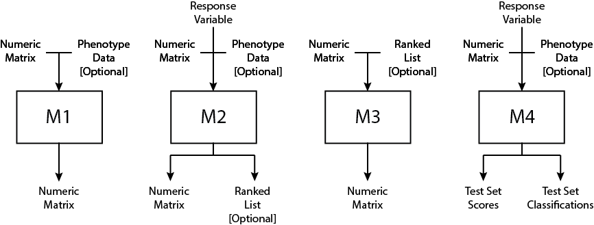

# Introduction
An introduciton to the rabbit package, its purpose, and its utility

# Quick Start

## Installing rabbit
Install the most recent version of the `r Githubpkg("jperezrogers/rabbit")` package directly from Github. A development version of the package is also available and can be downloaded by setting `ref="development"` though this version may be unstable.
```{r, eval=FALSE}
devtools::install_github("jperezrogers/rabbit", ref="master")
```

## Load Example Data
For illustrative purposes, we'll use the famous leukemia dataset from [Golub et al. (1999)](http://www.ncbi.nlm.nih.gov/pubmed/10521349) contained within the `r Biocpkg("multtest")` package. This dataset contains gene expression values of 3051 genes across 38 leukemia patients. 27 patients were diagnosed with acute lymphoblastic leukemia (ALL) and 11 were diagnosed with acute myeloid leukemia (AML). Within the outcome vector `golub.cl`, ALL patients are coded as `0` while AML patients are coded as `1`.
```{r, eval=FALSE}
library(multtest)
data(golub)
```

## Load Stock Pipeline
The  `r Githubpkg("jperezrogers/rabbit")` package provides a stock biomarker discovery pipeline developed based on the results from the MAQC-II study published by [Shi et al. (2010)](http://www.ncbi.nlm.nih.gov/pubmed/20676074). The stock pipeline is stored in the `stockPipeline` variable and contains 840 pre-build models, each with a unique combination of methods designed to select an optimal set of predictors and classification algorithm. For a more detailed description of the stock pipeline, see [Stock Pipeline](#stock-pipeline) below.
```{r, eval=FALSE}
library(rabbit)
data(stockPipeline)
```

The pipeline requires that each sample and feature (gene, in this case) have a unique name. Here, we add mock names to the `golub` data matrix.
```{r, eval=FALSE}
colnames(golub) <- paste("Sample", 1:ncol(golub), sep="_")
rownames(golub) <- paste("Gene", 1:nrow(golub), sep="_")
```

## Run Stock Pipeline
```{r, eval=FALSE}
run(stockPipeline, x=golub, y=as.factor(golub.cl), outputdir=getwd(), seed=1234, verbose=TRUE, force=TRUE)
```

## Interpreting Results


# Terminology

## Pipeline
A `Pipeline` is an `r CRANpkg("R6")` object that contains all of the information required to build and evaluate a set of classification models. Pipeline objects have the following members:

* `label` - a character vector of length 1 naming the `Pipeline` object
* `modules` - a list of `Module` objects (see below)
* `cv` - the cross-validation scheme to use. One of `cv`, `lgocv`, `loocv`, or `boot`. See [Creating Custom Pipelines](#creating-custom-pipelines) below for more details about each cross-validation method.
* `p` - the fraction of samples to include in the training set. This parameter is only active when `cv` is one of `lgocv`, or `boot`
* `nfolds` - the number of folds or iterations to use. This parameter is only active when `cv` is one of `cv`, `lgocv`, or `boot`

Pipelines are made up of [Modules](#module) (see below) and each provides a self-contained object that can be used to run a series of biomarker models. 

## Module
A `Module` is an `r CRANpkg("R6")` object which is added to a Pipeline. You should think of each module as a unique step in the development of a classification model (e.g. feature selection or classification). Every module is made up of tasks that have a similar input, output, and overall function. For example, you might want to try out two different linear modeling techniques to select genes associated with your variable of interest. In this case, these two different approaches would be added to your pipeline as individual tasks within the same module since they attempt to achieve the same goal of selecting a number of genes while employing slightly different techniques. Your module, in this case, might be called 'Feature Selection'.

### Module Types

#### M1
#### M2
#### M3
#### M4

## Task
A `Task` is the fundamental building block of a pipeline. A task object contains the actual function and parameters to apply to the data. Tasks are added to modules and 

# Stock Pipeline
The stock pipeline has been assembled to include the most used methods from the MAQC-II project (specifically those found in Table 2 of [Shi et al. (2010)](http://www.ncbi.nlm.nih.gov/pubmed/20676074)), as well as a few additional tasks to increase the diversity of methods available. 

## Configuration
The stock pipeline comes equipped with four modules and is designed to evaluate each model in 10-fold cross-validation. By default, when a new pipeline object is created, the `classification` module is already included. We then add a `gene filter` module for _unsupervised_ filtering methods, a `feature selection` module for _supervised_ filtering methods, and a `biomarker size` selection module to pick the final number of genes to be included in the classification model. 
```{r, eval=TRUE}
library(rabbit)
stockPipeline <- newPipeline(label = "stock", cv = "cv", nfolds = 10)
addModule(pipeline = stockPipeline, type = "M1", label = "gene filter")
addModule(pipeline = stockPipeline, type = "M2", label = "feature selection")
addModule(pipeline = stockPipeline, type = "M3", label = "biomarker size")
```

## Prebuilt Modules

### Gene Filter
The gene filter module (`label` = "gene filter") is a type-`M1` module and is the first module in the stock pipeline. It is designed to identify and remove genes in an unsupervised manner that are lowly expressed or that do not vary in expression across samples in the dataset. There are two tasks included in this module which are described below.

#### Median Absolute Deviation (MAD)
For each gene, the median absolute deviation is computed using the `stats::mad` function. MAD scores are then ranked in decreasing order, and the top `n` genes by MAD score are selected and returned where
```{r, eval=FALSE}
n = round(nrow(x)*fraction)
```
and `x` is the gene expression matrix with samples in columns and genes in rows and `fraction` is a decimal value between `0` and `1`. Three different values of `fraction` are built into the median absolute deviation task including `0.25`, `0.50`, and `0.75` with each being evaluated separately. The task definition is as follows:
```{r, eval=TRUE}
addTask(
  pipeline = stockPipeline,
  module = "gene filter",
  label = "mad",
  method = function(x,fraction=0.50){
    madev <- apply(x,1,mad)
    sorted.index <- sort(madev,decreasing=T,index.return=T)$ix
    max.keep <- round(nrow(x)*fraction)
    boundary <- madev[sorted.index[max.keep]]
    x <- x[madev>=boundary,]
    return(x)
  },
  parameters = data.frame(
    parameter = c("fraction"),
    class = c("numeric"),
    label = c("fraction"),
    stringsAsFactors = F
  ),
  control = list(
    fraction = c(0.25,0.50,0.75)
  )
)
```

#### Mean Expression Filter
For each gene, the mean expression is computed. Then, the array-wide average expression, `mu`, is computed by averaging each gene's mean-expression value such that
```{r, eval=FALSE}
mu = mean(apply(x,1,mean))
```
where `x` is the gene expression matrix with samples in columns and genes in rows. A one-tailed t-test is then used to rank genes based on how different their mean expression value is from the array-wide mean. Genes with a statistically significant p-value (p < 0.05) are selected and returned. The task definition is as follows:
```{r, eval=TRUE}
addTask(
  pipeline = stockPipeline,
  module = "gene filter",
  label = "mean-expression",
  method = function(x){
    mean.expr <- mean(apply(x,1,mean))
    p <- apply(x,1,function(i){
      t.test(i,mu=mean.expr,alternative="greater")$p.value
    })
    x <- x[p<0.05,]
    return(x)
  }
)
```

### Feature Selection
The feature selection module (`label` = "feature selection") is a type-`M2` module and is the second module in the stock pipeline. This module houses tasks that are designed to select genes that are most associated with the variable of interest `y` based on some metric. There are five tasks available in this module which are described in detail below.

#### Significance Analysis of Microarrays (SAM)
This task implements the Significance Analysis of Microarrays method published by [Tusher et al (2001)](http://www.ncbi.nlm.nih.gov/pubmed/11309499) and implemented in the `r CRANpkg("samr")` package. Genes are ranked by importance according to their p-value. The task definition is as follows:
```{r, eval=TRUE}
addTask(
  pipeline = stockPipeline,
  module = "feature selection",
  label = "SAM",
  method = function(x,y){
    y.tmp <- ifelse(y==0,1,2)
    data <- list(x=x,y=y.tmp, geneid=as.character(1:nrow(x)),genenames=row.names(x),logged2=TRUE)
    junk <- capture.output(o <- samr(data,resp.type="Two class unpaired",nperms=100))
    p <- samr.pvalues.from.perms(o$tt,o$ttstar)
    rank <- abs(p-1)
    rm(junk)
    return(list(x=x,rank=rank))
  },
  libraries = c("samr")
)
```
__NOTE:__ The `rank` of each gene is a transformation of the p-value returned by the `samr.pvalues.from.perms` function. Not all tasks in the feature selection module will rank genes based on p-values, thus we need to standardize the direction in which genes are ranked by the `rank` vector. The direction in which the ranks are sorted is an arbitrary decision, but one that needs to be consistent across all tasks in the module. In this case, we have chosen to rank genes in _descending_ order based on the `rank` vector output by tasks in the feature selection module. P-values are transformed by subtracting `1` and taking the absolute value such that genes with the lowest p-values retain the highest rank.

#### Fold Change + P-value
Genes are first scored by moderated t-statistic (using the `r Biocpkg("limma")` package and `eBayes` function). Genes with a p-value less than 0.05 are retained and then ranked by log2 fold-change. In the event that no genes pass the specified p-value threshold, all genes are retained and ranked by log2 fold-change. A gene expression matrix containing only those genes that pass the p-value threshold and their associated log2 fold-change rank is returned.
```{r, eval=TRUE}
addTask(
  pipeline = stockPipeline,
  module = "feature selection",
  label = "FC + P",
  method = function(x,y){
    fc <- apply(x,1,function(i){
      mean(i[y==levels(y)[1]])/mean(i[y==levels(y)[2]])
    })
    mod <- model.matrix(~y)
    fit <- limma::lmFit(x,mod)
    modt <- limma::eBayes(fit)
    p <- modt$p.value[,2]
    if(sum(p<0.05)>0){
      x <- x[p<0.05,]
      rank <- fc[p<0.05]
    } else {
      x <- x
      rank <- fc
    }
    return(list(x=x,rank=rank))
  },
  libraries = c("limma")
)
```

#### Student T-test
A two-tailed student t-test assuming equal variances applied to each gene using the `mt.teststat` function from within the `r Biocpkg("multtest")` package for quick computation. Genes are ranked by p-value.
```{r, eval=TRUE}
addTask(
  pipeline = stockPipeline,
  module = "feature selection",
  label = "t-test",
  method = function(x,y){
    t <- multtest::mt.teststat(x,y)
    p <- 2 * pt(-abs(t), df=ncol(x)-2)
    rank <- abs(p-1)
    return(list(x=x,rank=rank))
  },
  libraries = c("multtest")
)
```

#### Partial AUC
The partial area under the receiver operating characteristic curve is computed for each gene. This task utilized the `rowpAUCs` function from within the `r Biocpkg("genefilter")` package. See [Pepe et al. (2003)](http://www.ncbi.nlm.nih.gov/pubmed/12762450) for details on the partial AUC method.
```{r, eval=TRUE}
addTask(
  pipeline = stockPipeline,
  module = "feature selection",
  label = "pAUC",
  method = function(x,y){
    pauc <- area(genefilter::rowpAUCs(x,y,flip=TRUE))
    return(list(x=x,rank=pauc))
  },
  libraries = c("genefilter")
)
```

#### Signal to Noise Ratio
The signal-to-noise ratio as described by [Golub et al. (1999)](http://www.ncbi.nlm.nih.gov/pubmed/10521349) is computed for each gene with respect to the variable of interest `y`. Specifically, the difference in mean expression between levels of `y` are divided by the sum of their standard deviations. Genes are ranked based on their signal-to-noise ratio.
```{r, eval=TRUE}
addTask(
  pipeline = stockPipeline,
  module = "feature selection",
  label = "signal-to-noise",
  method = function(x,y){
    mu1 <- rowMeans(x[,y==levels(y)[1]])
    sd1 <- apply(x[,y==levels(y)[1]],1,sd)
    mu2 <- rowMeans(x[,y==levels(y)[2]])
    sd2 <- apply(x[,y==levels(y)[2]],1,sd)
    ratio <- abs((mu1-mu2)/(sd1+sd2))
    return(list(x=x,rank=ratio))
  }
)
```

### Biomarker Size
The biomarker size module (`label` = "biomarker size") is a type-`M3` module and is the third module in the stock pipeline. This module stores tasks that use the gene expression matrix `x` and list of gene ranks `rank` from the previous module to select a set number of genes for inclusion in the final classifier. There is only one task in this module and it is described below.

#### Size Selection
The size selection task selects the top `n` genes based on their value in `rank`. The number of genes selected varies depending on the value passed to the parameter `size`. By default, values of `5`, `25`, `50`, `100`, `500` are used in the stock pipeline. In the event that the size selection task requests more genes than are available (e.g. if `size` = 500 but only 200 genes were retained after feature selection), the maximum number of genes available is used. 
```{r, eval=TRUE}
addTask(
  pipeline = stockPipeline,
  module = "biomarker size",
  label = "size selection",
  method = function(x,rank,size=5){
    if(length(rank)!=nrow(x)){
      stop(paste0("biomarker size -> size selection: input parameter 'rank' must have length equal to nrow(x). Actual: length(rank) = ",length(rank),", nrow(x) = ",nrow(x)))
    }
    if(size>length(rank)){
      size <- length(rank)
      warning(paste0("biomarker size -> size selection: more features requested (n=",size,") than available in parameter 'x' (n=",length(rank),"). Using maximum available features instead."))
    }
    x <- x[sort(rank,decreasing=T,index.return=T)$ix[1:size],]
    return(x)
  },
  parameters = data.frame(
    parameter = c("size"),
    class = c("numeric"),
    label = c("size"),
    stringsAsFactors = F
  ),
  control = list(
    size = c(5,25,50,100,200,500)
  )
)
```

### Classification
The classification module (`label` = "classification") is a type-`M4` module and is the forth and final module in the stock pipeline. This module is responsible for training a predictive algorithm on the internal training set and evaluated that model on the internal test set within cross-validation. There are seven classification tasks included in the stock pipeline which are described in detail below. Where possible, the classifier is trained using the `r CRANpkg("caret")` package to take advantange of its `train` and `predict` functions which provide a uniform interface to hundreds of algorithms. 

#### Linear Descriminant Analysis
```{r, eval=TRUE}
addTask(
  pipeline = stockPipeline,
  module = "classification",
  label = "lda",
  method = function(x,y,testdata){
    control <- trainControl(method="none")
    mod <- suppressMessages(caret::train(x=t(x), y=as.factor(y), method="lda", trControl=control))
    preds <- predict(mod, newdata=t(testdata), type="prob")
    classes <- predict(mod, newdata=t(testdata), type="raw")
    return(list(score=preds[,1],class=classes))
  },
  libraries = "caret"
)
```

#### Random Forest
The random forest task uses 5x 10-fold cross-validation to tune the `mtry` parameter. By default, the number of trees is set to `500`. 
```{r, eval=TRUE}
addTask(
  pipeline = stockPipeline,
  module = "classification",
  label = "random forest",
  method = function(x,y,testdata){
    control <- trainControl(method="repeatedcv", number=10, repeats=5, 
                            search="random")
    mod <- suppressMessages(caret::train(x=t(x), y=as.factor(y), method="rf", metric="ROC",
                        trControl=control, tuneLength=10))
    preds <- predict(mod,newdata=t(testdata),type="prob")
    classification <- predict(mod,newdata=t(testdata),type="raw")
    return(list(score=preds[,1],class=classification))
  },
  libraries = "caret"
)
```

#### Naive Bayes
```{r, eval=TRUE}
addTask(
  pipeline = stockPipeline,
  module = "classification",
  label = "naive bayes",
  method = function(x,y,testdata){
    control <- trainControl(method="none")
    grid <- data.frame(fL=0, usekernel=FALSE, adjust=FALSE)
    mod <- suppressMessages(train(x=t(x), y=as.factor(y), method="nb", trControl=control,
                 tuneGrid=grid))
    preds <- suppressWarnings(predict(mod,newdata=t(testdata),type="prob"))
    classification <- suppressWarnings(predict(mod,newdata=t(testdata),
                                               type="raw"))
    return(list(score=preds[,1],class=classification))
  },
  libraries = "caret"
)
```

#### K-Nearest Neighbors
The k-nearest neighbors task uses 5x 10-fold cross-validation to tune the `k` parameter. 
```{r, eval=TRUE}
addTask(
  pipeline = stockPipeline,
  module = "classification",
  label = "knn",
  method = function(x,y,testdata){
    y.tmp <- ifelse(y==0,"Class_0","Class_1")
    kmax <- round(sqrt(ncol(x)))
    kmax <- ifelse(kmax%%2==0,kmax+1,kmax)
    control <- trainControl(method="repeatedcv", number=10, repeats=5,
                            search="grid",selectionFunction="oneSE",
                            summaryFunction=twoClassSummary, classProbs=TRUE)
    mod <- suppressMessages(caret::train(x=t(x), y=as.factor(y.tmp), method="knn", trControl=control,
                        metric="ROC", maximize=TRUE, 
                        tuneGrid=expand.grid(k=1:kmax)))
    opt.k <- caret::oneSE(mod$results, metric="ROC",num=5, maximize=TRUE)
    control <- trainControl(method="none")
    mod <- suppressMessages(
      caret::train(x=t(x), y=as.factor(y.tmp), method="knn", trControl=control, 
                        tuneGrid=data.frame(k=opt.k)))
    preds <- predict(mod,newdata=t(testdata),type="prob")
    classification <- predict(mod,newdata=t(testdata),type="raw")
    return(list(score=preds[,1],class=classification))
  },
  libraries = "caret"
)
```

#### Support Vector Machine (Radial)
The support vector machine task uses 5x 10-fold cross-validation to tune the `sigma` and `C` parameters
```{r, eval=TRUE}
addTask(
  pipeline = stockPipeline,
  module = "classification",
  label = "svm",
  method = function(x,y,testdata){
    y.tmp <- ifelse(y==0,"Class_0","Class_1")
    control <- trainControl(method="repeatedcv", number=10, repeats=5, 
                            summaryFunction=twoClassSummary, classProbs=TRUE)
    mod <- suppressMessages(
      train(x=t(x), y=as.factor(y.tmp), method="svmRadial", tuneLength=10,
                 preProc=c("center","scale"), metric="ROC", trControl=control))
    preds <- predict(mod,newdata=t(testdata),type="prob")
    classification <- predict(mod,newdata=t(testdata),type="raw")
    return(list(score=preds[,1],class=classification))
  },
  libraries = "caret"
)
```

#### Weighted Voting
```{r, eval=TRUE}
addTask(
  pipeline = stockPipeline,
  module = "classification",
  label = "weighted voting",
  method = function(x,y,testdata){
    mod <- suppressMessages(wv.model(x,y))
    preds <- predict.wv(mod,testdata, type="prob")
    classification <- predict.wv(mod,testdata, type="raw")
    return(list(score=preds,class=classification))
  },
  libraries = "caret"
)
```

#### Elastic Net Regression
The elastic net task uses 5x 10-fold cross-validation to tune the `alpha` and `lambda` parameters.
```{r, eval=TRUE}
addTask(
  pipeline = stockPipeline,
  module = "classification",
  label = "elastic net",
  method = function(x,y,testdata){
    y.tmp <- ifelse(y==0,"Class_0","Class_1")
    control <- trainControl(method="repeatedcv", number=10, repeats=5, 
                            summaryFunction=twoClassSummary, classProbs=TRUE)
    grid <- expand.grid(alpha=seq(0,1,length=10), lambda=10^seq(2,-2,length=100))
    mod <- suppressMessages(
      train(x=t(x), y=as.factor(y.tmp), method="glmnet", trControl=control,
                 tuneGrid=grid, metric="ROC"))
    preds <- predict(mod,newdata=t(testdata),type="prob")
    classification <- predict(mod,newdata=t(testdata),type="raw")
    return(list(score=preds[,1],class=classification))
  },
  libraries = "caret"
)
```

## Customization
The stock pipeline was built to provide the user with a minimal set of tools to build and evaluate predictive models on high dimensional data. However, not all modules and tasks may be valid or their use desired for every dataset. As a result, there are a number of functions provided to customize the stock pipeline, or any pipeline for that matter. 

### Activating/Deactivating Tasks
Tasks within a pipeline can be activated and deactivated using the `activateTask` and `deactivateTask` functions, respectively. The active/inactive status of each task is accessed using the `summary` function setting `level` = "active"
```{r, eval=TRUE}
summary(stockPipeline, level="active")
```

```{r, eval=TRUE}
deactivateTask(pipeline=stockPipeline, module="feature selection", task="pAUC")
deactivateTask(pipeline=stockPipeline, module="classification", task=c("lda","random forest"))
activateTask(pipeline=stockPipeline, module="classification", task="random forest")
summary(stockPipeline, level="active")
```

### Adding/Deleting Tasks
Tasks can also be easily added and deleted from the stock pipeline using the `addTask` and `deleteTask` functions. For more a more detailed description of these functions and their input parameters, see [Adding Tasks to Modules](#adding-tasks-to-modules) below.
```{r, eval=TRUE}
deleteTask(pipeline=stockPipeline, module="feature selection", task="SAM")
summary(stockPipeline, level="active")
```

Then, we can add the task back using the `addTask` function.
```{r, eval=TRUE}
addTask(
  pipeline = stockPipeline,
  module = "feature selection",
  label = "SAM",
  method = function(x,y){
    y.tmp <- ifelse(y==0,1,2)
    data <- list(x=x,y=y.tmp, geneid=as.character(1:nrow(x)),genenames=row.names(x),logged2=TRUE)
    junk <- capture.output(o <- samr(data,resp.type="Two class unpaired",nperms=100))
    p <- samr.pvalues.from.perms(o$tt,o$ttstar)
    rank <- abs(p-1)
    rm(junk)
    return(list(x=x,rank=rank))
  },
  libraries = c("samr")
)

summary(stockPipeline, level="active")
```

### Modifying Existing Tasks
Occasionally the user may want to reconfigure or modify a task that is already in the stock pipeline. The `getCall` function can be used to return the code used to generate a given task. This allows the user to easily create a new task or overwrite an existing task without having to rewrite the code from scratch. The `getCall` function returns a named list with elements corresponding to the input parameters of the `addTask` function. 
```{r, eval=TRUE}
task.mad <- getCall(stockPipeline, "gene filter", "mad")
task.mad
```
To add a task back to the pipeline after modifying the list returned by `getCall`, use the `do.call` function
```{r, eval=TRUE}
do.call(what=addTask, args=task.mad)
```

### Changing the Cross-Validation Scheme
The stock pipeline has three parameters that can be modified to customize the cross-validation scheme used when the pipeline is run. 

* `cv` - can be set to `cv`, `lgocv` [default], `loocv`, or `boot` (see [Creating a New Pipeline](#creating-a-new-pipeline) below for more details on each option). 
* `p` - adjusts the fraction of samples that are included in the training set at each cross-validation run and can take on a value between 0 and 1 (__NOTE__: `p` is only used when `cv` is set to `lgocv` or `boot`). 
* `nfolds` - sets the number of folds (occasionally referred to as iterations). When `cv` is set to `cv`, `nfolds` determines the structure of the k-fold cross-validation. When `cv` is `lgocv` or `boot`, `nfolds` determines the number of sampling iterations to compute. 

Each of these parameters can be modified using the `update` function.
```{r, eval=TRUE}
update(pipeline=stockPipeline, what="cv", value="lgocv")
update(pipeline=stockPipeline, what="p", value=0.70)
update(pipeline=stockPipeline, what="nfolds", value=20)
summary(stockPipeline)
```

# Creating Custom Pipelines
In some instances, you may want to build a pipeline from the ground up to fully customize your model building methods. The `r Githubpkg("jperezrogers/rabbit")` package provides a framework and a powerful set of tools that allow the user to build and design custom predictive models.

## Creating a New Pipeline
To start, you have to create a new pipeline object using the `newPipeline` function. The only required input parameter, by default, is the `label` which essentially gives the pipeline a name. Other input parameters are available which allow you to customize the cross-validation scheme that will be used when the pipeline is run. The input parameters to `newPipeline` are as follows:

* `label` - a character string naming the pipeline
* `cv` - the cross-validation method to use. Must be one of `cv`, `lgocv` [default], `loocv`, or `boot` (details below)
* `p` - the fraction of samples that are included in the internal training set within each fold of cross-validation [numeric between 0 and 1, default `0.80`]
* `nfolds` - the number of folds or iterations to compute [integer, default `10`]

When parameter `cv` is set to `cv`, ordinary k-fold cross-validation is used where the number of folds k is defined by the value of `nfolds`. `lgocv` implies leave-group-out cross-validation where `p` defines the fraction of samples to be randomly assigned to the training set and `nfolds` indicates the number of random data partitions to compute. `loocv` implies leave-one-out cross-validation in which each sample is left out of training and is predicted one time. In `loocv`, neither `p` nor `nfolds` are used. Finally, `boot` implies bootstrapped cross-validation in which `n` samples are randomly selected with replacement where `n` is the total number of samples in the dataset. Samples not included in the internal training set are used as a test set in bootstrapped cross-validation.

Parameter `p` determines the fraction of samples included in the internal training set and is only used when `cv` is `lgocv`. In this case, a good choice of `p` is usually between 0.50 and 0.90 with the default value being set to 0.80. If your dataset is small, choosing a large value for `p` may result in very few samples being predicted in the test set while smaller values of `p` may underpower your training set.

Parameter `nfolds` is used when `cv` is set to `cv`, `lgocv`, or `boot`. Traditionally, if `cv` = `cv`, 5 or 10-fold cross-validation is typically used. Higher or lower values of `nfolds` may result in small test sets or an insufficient number of cross-validated loops, respectively. When using leave-group-out or bootstrapped cross-validation, the number of folds could be much higher, in the range of 100s or 1000s if desired. 

```{r, eval=TRUE}
customPipeline <- newPipeline(label = "custom_pipeline", cv = "lgocv", nfolds = 100, p = 0.80)
```

## Adding a New Module to a Pipeline
Once you have created a new pipeline object you can start to add new modules to it. Each new module will represent a "step" in the pipeline. By default, when a new pipeline is created, it comes packages with a 'classification' module already installed. The reason for this is simple. The point of a pipeline is to train and evaluate a predictive model on a dataset, which intuitively means there needs to be a classification module that functions as the last "step" in the pipeline. Therefore, every pipeline must have a classification module and it must be the last module employed when evaluating models. We can see this using the `summary` function:
```{r, eval=TRUE}
summary(customPipeline, level="structure")
```
As you can see, the pipeline has one module, named 'classification' and that module contains no tasks. At this point we can 1) add tasks to the 'classification' module or 2) we can continue building the bones of our custom pipeline and add a few more modules. 

Taking the latter approach, let's add another module using the `addModule` function. `addModule` takes three arguments:

* `pipeline` - the pipeline object to which the module should be added
* `type` - the module type to add. One of `M1`, `M2`, or `M3`
* `label` - a character string naming the module

There are four different types of modules available in this package (`M1`, `M2`, `M3`, and `M4`) which differ based on the expected inputs and outputs of their tasks. `M1`, `M2`, and `M3` modules can all be added to a pipeline object by the user. `M4` modules are 'classification' modules which are automatically added to each pipeline at initialization and cannot be re-added or deleted. Each module is described in detail below:



### M1 Modules
Type `M1` modules store tasks that take in a numerical matrix and output a numerical matrix. Optionally, these tasks may also take in phenotype information in the form of a `data.frame`. `M1` modules are used primarily for _unsupervised_ processes (those that do not use the response variable `y`) that are applied to the expression matrix. One example use case for an `M1` module would be to perform some sort of feature filtering, perhaps based on a gene's expression level or variance as in the stock pipeline example above. An expression matrix is read in by the tasks in the `M1` module, a subset is selected for, then an expression matrix is returned. The only assumption is that the column names will be identical between the input and output expression matrix. It's important to note that the expression matrix returned by a task in an `M1` module does __not__ need to have the same number of rows (genes) as the matrix that was passed to it, thus allowing the user to _select_ genes based on some metric and ensure that only those genes are passed to the next step in the pipeline.

A second example use case for an `M1` module would be to create a 'batch correction' module where the expression matrix is read in, modified, and then returned by the task. Let's try to create the `method` parameter for a task in an `M1` module using the `ComBat` function from within the `r Biocpkg("sva")` package which we can use to apply a batch correction to our expression data. `ComBat` requires both a gene expression matrix (in our case, `x`), and the batch annotation which we can store in our phenotype data.frame `data`. We pass both `x` and `data` to our function and return the batch corrected matrix to the pipeline. 
```{r, eval=FALSE}
# an example 'method' parameter for a task in an 'M1' module
method <- function(x,data){
  mod <- model.matrix(~1, data=data)
  new.x <- sva::ComBat(dat=x, batch=data$batch, mod=mod)
  return(new.x)
}
```

### M2 Modules
Type `M2` modules store tasks that take a numerical matrix, response variable, and (optionally) a data.frame of phenotypic information. Unlike `M1` modules, `M2` modules are designed for _supervised_ processes (those making use of the response variable `y`). In the stock pipeline example above, we used an `M2` module for the feature selection module, where tasks select genes based on their association with `y`. `M2` modules can be used not only to select genes (e.g. by returning an expression matrix containing only genes meeting a desired criteria), but also to rank genes in the event that 'selection' occurs at a later step in the pipeline. To fascilitate this functionality, tasks in `M2` modules need to output either 1) an expression matrix _or_ 2) a list containing an expression matrix named `x` and a ranked list named `rank`. 
```{r, eval=FALSE}
# an example 'method' parameter for a task in an 'M2' module
method = function(x,y){
  t <- multtest::mt.teststat(x,y)
  p <- 2 * pt(-abs(t), df=ncol(x)-2)
  rank <- abs(p-1)
  return(list(x=x, rank=rank))
}
```

### M3 Modules

### M4 Modules

## Adding Tasks to Modules
__NOTE:__ only __active__ tasks are displayed in the pipeline structure summary. Inactive tasks will not be used when the pipeline is run and thus do not contribute to its overall structure.

### Task Components

### Method Element

#### Specific Requirements for Tasks Added to M1 Modules

#### Specific Requirements for Tasks Added to M2 Modules

#### Specific Requirements for Tasks Added to M3 Modules

#### Specific Requirements for Tasks Added to M4 Modules

### Parameters Element

### Control Element

## Activating/Deactivating Tasks

## Rearranging Modules

## Summary Functions

# Additional Considerations

## Cross-Validation Scheme vs Sample Size

## Parallelization

## Debugging

